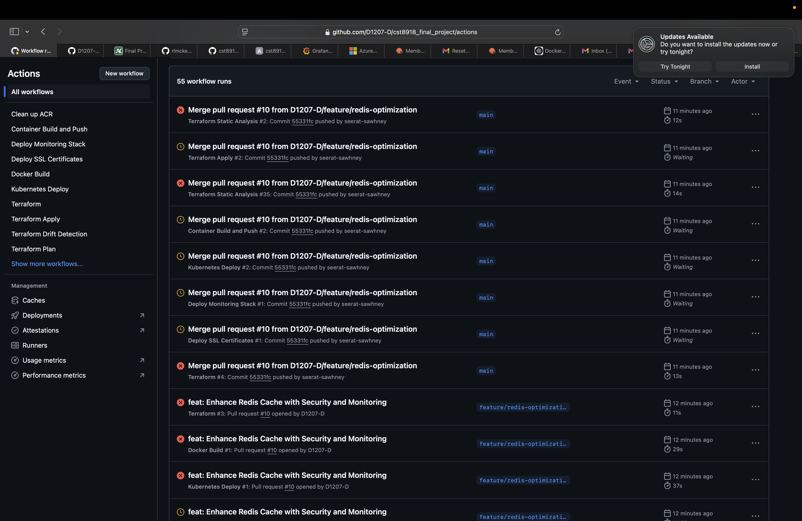

# CST8918 Final Project - Weather Application on AKS

## Overview
This project implements a Terraform-managed infrastructure on Azure for deploying a Remix Weather Application. The infrastructure includes AKS clusters, managed Redis DB, and uses GitHub Actions for automation.

## Team Members

| Name | Student ID | GitHub |
|------|------------|--------|
| Rhythm Sharma | 041131315 | [@rhythmsh05](https://github.com/rhythmsh05) |
| Seerat Sawhney | 041107886 | [@seerat-sawhney](https://github.com/seerat-sawhney) |
| Yogesh Bhatt | 041152861 | [@yogeshBhatt897](https://github.com/yogeshBhatt897) |
| Daniyal Shahid | 041110791 | [@D1207-D](https://github.com/D1207-D) |

## Features

- Real-time weather data using OpenWeather API
- Redis caching for improved performance
- SSL/TLS security
- Prometheus and Grafana monitoring
- Automated deployments using GitHub Actions
- Infrastructure as Code using Terraform

## Project Structure
```
├── .github/
│   └── workflows/          # GitHub Actions workflow definitions
└── infra/                  # Terraform infrastructure code
    ├── backend/            # Azure Storage backend configuration
    ├── network/            # Network infrastructure (VNet, subnets)
    ├── aks/                # AKS cluster configurations
    ├── redis/              # Redis cache configurations
    └── weather_app/        # Weather application deployment
```

## Infrastructure Components
- Azure Kubernetes Service (AKS) clusters for test and production
- Azure Cache for Redis instances
- Virtual Network with dedicated subnets
- Azure Container Registry
- Azure Storage for Terraform state
- Prometheus & Grafana for monitoring

## GitHub Actions Workflows



Our project uses several GitHub Actions workflows:

1. **Terraform Plan & Apply**: Manages infrastructure deployment
2. **Container Build**: Builds and pushes Docker images
3. **Kubernetes Deploy**: Deploys application to AKS
4. **Monitoring Deploy**: Sets up Prometheus and Grafana

## Getting Started

### Prerequisites

- Azure subscription
- Azure CLI
- Terraform
- kubectl
- Node.js 16+

### Environment Variables

Create a `.env` file with:

```env
AZURE_CLIENT_ID=
AZURE_TENANT_ID=
AZURE_SUBSCRIPTION_ID=
REGISTRY_NAME=
RESOURCE_GROUP=
AKS_CLUSTER_NAME=
GRAFANA_ADMIN_PASSWORD=
OPENWEATHER_KEY=
DOMAIN_NAME=
```

### Deployment Steps

1. **Clone and Setup**
   ```bash
   git clone https://github.com/D1207-D/cst8918_final_project.git
   cd cst8918_final_project
   ```

2. **Initialize Terraform**
   ```bash
   cd infra
   terraform init
   ```

3. **Apply Infrastructure**
   ```bash
   terraform apply
   ```

4. **Get AKS Credentials**
   ```bash
   az aks get-credentials --resource-group <resource-group> --name <cluster-name>
   ```

5. **Deploy Application**
   ```bash
   kubectl apply -f kubernetes/
   ```

## Development Workflow
1. Create a new branch for your feature
2. Make changes and commit
3. Create a pull request
4. Wait for reviews and CI checks to pass
5. Merge after approval

## Branch Protection Rules
- Requires pull request before merging
- Requires status checks to pass
- Requires branches to be up to date
- No self-review allowed

## Status Checks
- Terraform Format Check
- Terraform Validation
- TFLint Analysis
- Infrastructure Plan Review

## License

This project is licensed under the MIT License - see the [LICENSE](LICENSE) file for details.